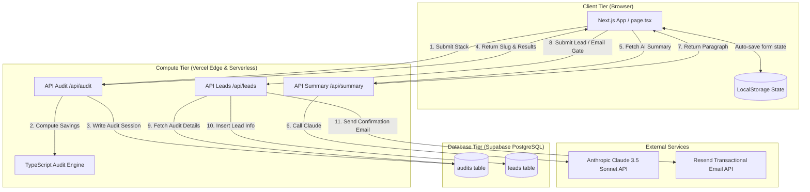

# System Architecture & Design

This document details the system design, data flows, and infrastructure scalability plan for **SpendScope**.

## 🗺️ System Diagram

The following Mermaid diagram outlines the end-to-end architecture of the application:

---

## 🔄 Data Flow

1. **Workspace Context & Stack Entry:** The user inputs their developer team size, use case, and selected AI subscriptions (e.g. Cursor Pro, Copilot Business).
2. **Persistence Loop:** As changes are made, the form state synchronizes with client-side `LocalStorage` to prevent data loss on page refreshes.
3. **Audit Submission:** The client clicks "Run Spend Audit". Next.js sends a POST request to `/api/audit` containing the stack configuration.
4. **Deterministic Calculation:** The server-side Audit Engine runs static business formulas against the stack to output potential savings, plan downgrades, and B2B Credex credits qualification.
5. **Slug Generation & Database Save:** The server generates a unique 8-character alphanumeric slug (e.g., `x7rT2b`), inserts the anonymous audit parameters into the Supabase `audits` table, and returns the slug and calculations to the client.
6. **AI Summary Fetch:** The client requests a customized narrative summary from `/api/summary`. The server asks Anthropic Claude 3.5 Sonnet to compile a 100-word paragraph detailing the specific stack savings.
7. **Lead Capture & Email Dispatch:** To export the report, the user enters their email. The client posts the data to `/api/leads`. The API route runs honeypot and structure verification, writes the lead details to the `leads` table (linked via `audit_id`), and issues an email request to Resend which dispatches the summary and a custom booking link to high-savings prospects.

---

## 🛠️ Stack Justification

- **Next.js 14 (App Router, TS):** Combining the frontend and backend in a unified structure simplifies deployment. The Serverless App Router allows `/api` handlers to run on demand, removing the cost and overhead of maintaining a separate Node.js server.
- **TailwindCSS & Glassmorphism:** Standard CSS variable-based styling coupled with Tailwind classes allowed us to construct a customized, dark-mode design (midnight backgrounds, glowing highlights, and neon metrics) to build trust with developers.
- **Supabase (PostgreSQL):** A relational database is optimal for linking leads directly to calculated audits (`leads.audit_id -> audits.id`). Postgres supports robust queries and indexing.
- **Resend:** A developer-focused transactional email provider with reliable delivery rates and clean react-email templates.

---

## ⚡ Scaling to 10,000+ Audits/Day

If SpendScope launched on Product Hunt and received high traffic (10,000+ audits/day), we would implement the following infrastructure changes:

1. **Move Audit Calculations to the Edge:**
   - The core `runAudit` function is written in pure, dependency-free TypeScript. We can configure `/api/audit` to run on **Vercel Edge Middleware** instead of Node.js Serverless. This slashes cold starts to < 5ms and handles high concurrency easily.
2. **Implement Rate Limiting via Redis:**
   - Deploy **Upstash Redis** on `/api/leads` and `/api/summary` to enforce request quotas per IP address (e.g. 5 audits/min, 2 lead exports/min), protecting database connection pools and API billing.
3. **Database Read Replicas & Connection Pooling:**
   - Introduce **Supabase PgBouncer** connection pooling to recycle connections.
   - Separate queries: public shared views (`/[slug]`) would read from a cached edge database (e.g., Cloudflare KV or Redis cache), while writes would go directly to the primary Postgres database.
4. **Asynchronous Email & AI Queues:**
   - Instead of calling Anthropic Claude and Resend blocking the user's HTTP request thread, we would immediately save the lead state, return the HTTP response, and delegate email/summary generation to a background queue (e.g., **Inngest** or **QStash**). This ensures that if Claude experiences a spike in latency, the user's interface remains snappy.
