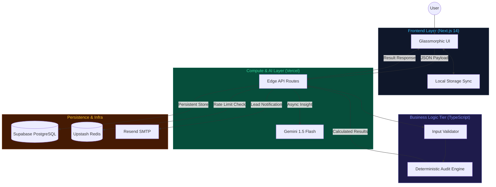
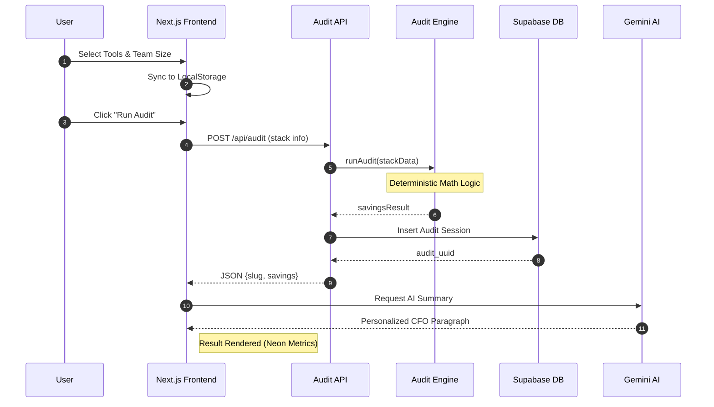
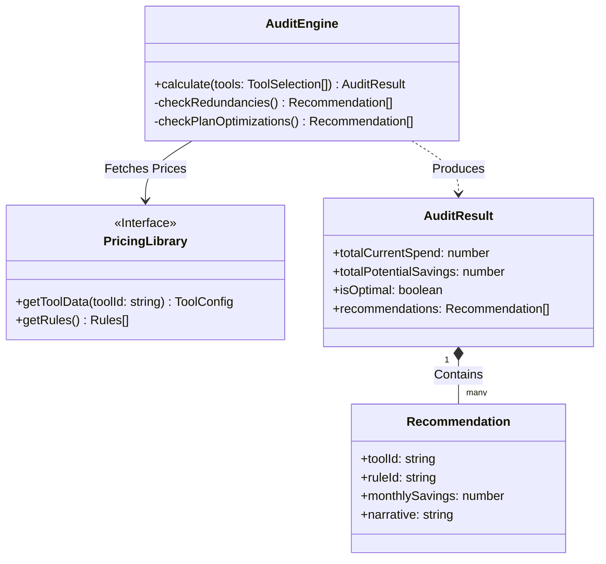
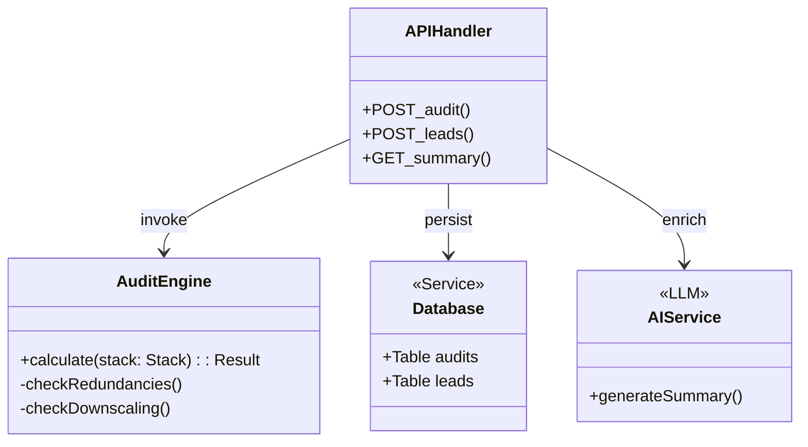

# System Architecture & Design

This document details the system design, data flows, and infrastructure scalability plan for **SpendScope**.

## High-Level Architecture

The application follows a modern serverless architecture with clear separation between the client-side interaction layer, the deterministic business logic tier, and the persistent storage layer.

---

## Detailed Data Flow (Sequence Diagram)

The following sequence details how a user's raw tool selection is transformed into a prioritized financial optimization report.

---

## Technical Stack & Component Roles

### 1. The Deterministic Math Engine (`auditEngine.ts`)
The "brain" of the application. Unlike traditional AI tools that might hallucinate financial figures, SpendScope uses a **Hard-Coded Pricing Matrix**. 
- **Roles:** Identifies $20/mo overlaps, calculates $100/mo seat-minimum penalties (Claude Team), and suggests $50/mo plan downgrades.
- **Why:** Financial data requires 100% precision.

### 2. The Narrative Layer (`Gemini 1.5 Flash`)
Leveraged through the `/api/summary` route to add a "Human" touch to the data.
- **Roles:** Takes raw JSON math and converts it into a professional CFO-summary paragraph.
- **Fallback:** Includes a deterministic string builder if the AI service experiences latency.

## Software Architecture (Class Diagram)

The application logic is modularized to ensure that pricing updates do not impact the core calculation engine.

### 3. Edge Persistence Layer
- **Supabase:** Used as the primary relational store. We maintain strict separation between **Anonymous Audits** and **PII Leads** to ensure security.
- **Upstash:** Provides a fast, global rate-limiting layer to protect the Gemini and Resend endpoints from automated abuse.

---

## Software Component Diagram (Low-Level)

---

## ⚡ Scaling to 10,000+ Audits/Day

If SpendScope launched on Product Hunt and received high traffic (10,000+ audits/day), we would implement the following infrastructure changes:

1. **Move Audit Calculations to the Edge:**
   - The core `runAudit` function is written in pure, dependency-free TypeScript. We can configure `/api/audit` to run on **Vercel Edge Middleware** instead of Node.js Serverless. This slashes cold starts to < 5ms and handles high concurrency easily.
2. **Tune Rate Limiting via Redis:**
   - The app already supports **Upstash Redis** on `/api/audit`, `/api/leads`, and `/api/summary` to enforce request quotas per IP address.
3. **Database Read Replicas & Connection Pooling:**
   - Introduce **Supabase PgBouncer** connection pooling to recycle connections.
   - Separate queries: public shared views (`/[slug]`) would read from a cached edge database (e.g., Cloudflare KV or Redis cache), while writes would go directly to the primary Postgres database.
4. **Asynchronous Email & AI Queues:**
   - Instead of calling Gemini and Resend blocking the user's HTTP request thread, we would immediately save the lead state and delegate email/summary generation to a background queue (e.g., **Inngest** or **QStash**).

