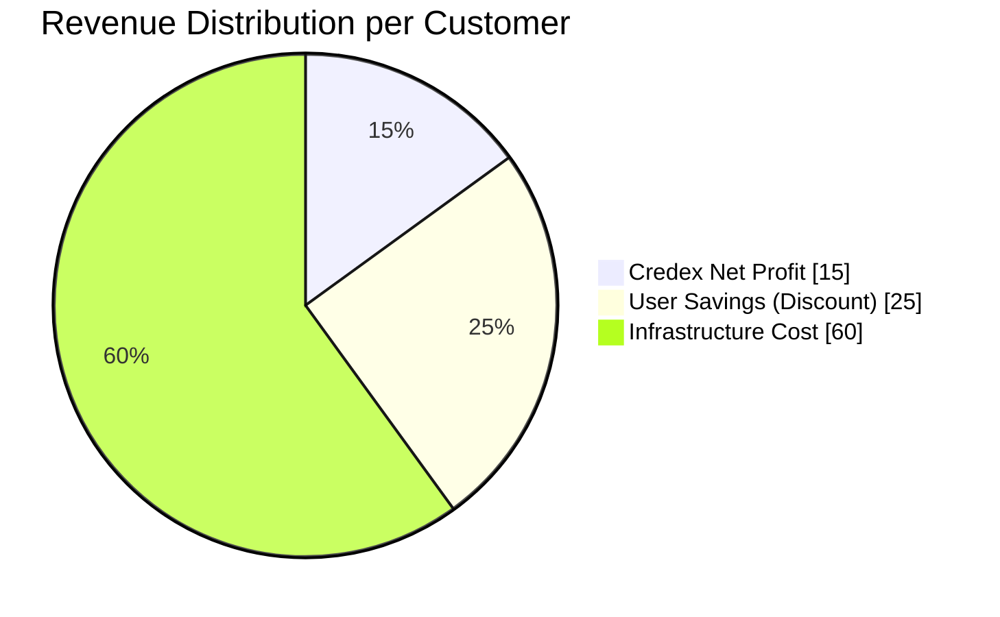
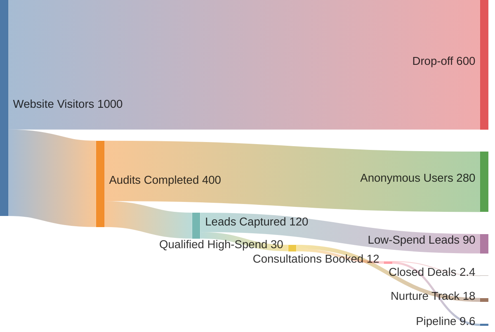
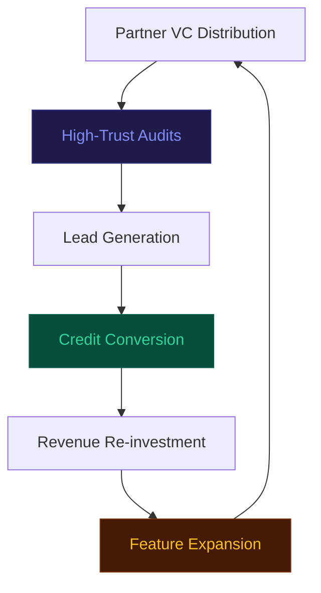
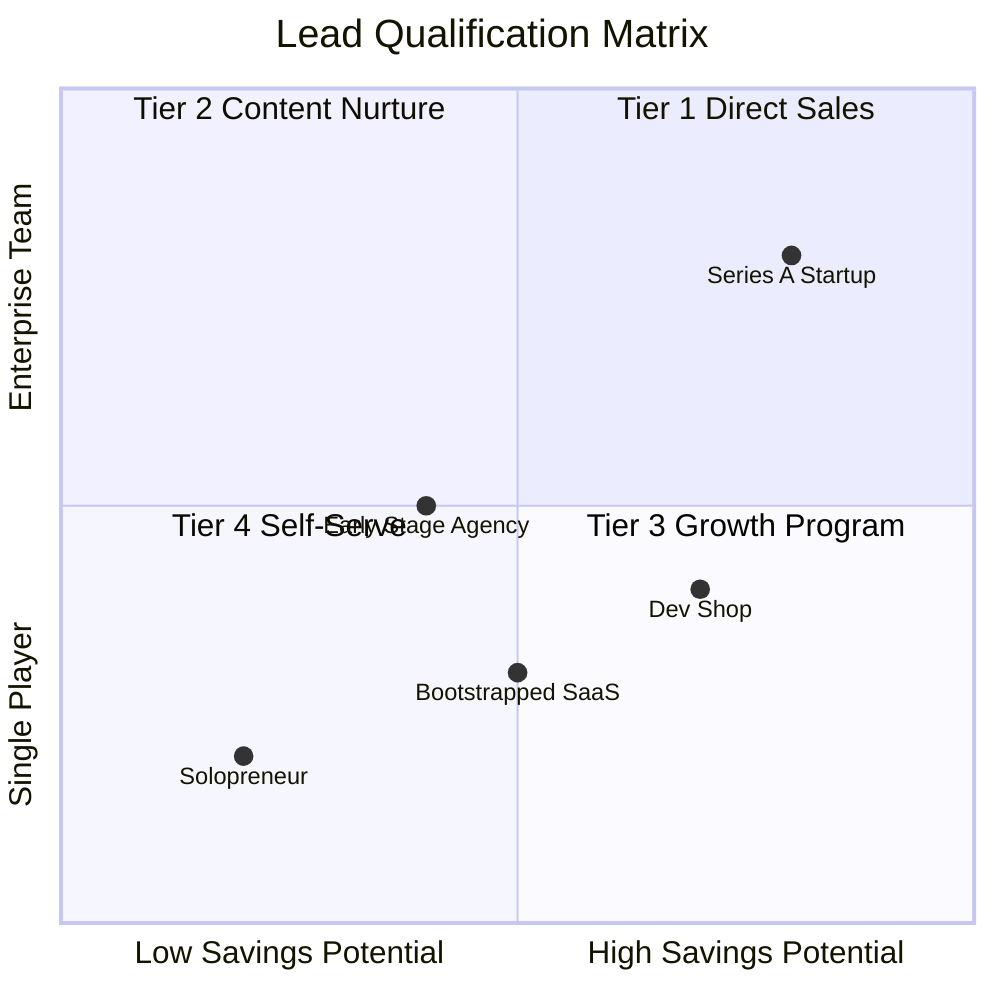

# Unit Economics and Revenue Strategy

This document details the financial model, conversion funnel metrics, and scalability parameters for SpendScope as a lead-generation asset for Credex.

## Revenue Model: Bulk Credit Arbitrage

Credex operates on a volume-based margin model, procuring AI infrastructure credits in bulk and distributing them to startups at a discount.

### Core Financial Matrix

| Metric | Value | Rationale |
| :--- | :--- | :--- |
| **Avg. Annual AI Spend** | $24,000 | Baseline for Seed/Series A startups |
| **Gross Margin %** | 15% | Spread between bulk cost and retail-discount price |
| **Initial Transaction Profit** | $1,500 | Assumes a 6-month credit bundle ($10k) |
| **LTV (24-Month)** | $6,000 | Lifetime value based on recurring credit renewals |
| **CAC Threshold (Paid)** | $1,664 | Maximum viable acquisition cost (LinkedIn Ads) |

### Profit Attribution Breakdown

---

## Conversion Funnel Dynamics

The SpendScope funnel is designed to qualify high-intent buyers through the audit process.

### Lead Value Chain (Sankey Projection)

---

## Scalability to $1M ARR

To achieve $1,000,000 in Annual Recurring Revenue, we must maintain a consistent volume of closed credit deals.

### Pipeline Requirements

| Stage | Monthly Volume | Target Group |
| :--- | :--- | :--- |
| **Total Traffic** | 23,333 UVs | Startup Founders & EMs |
| **Audits Run** | 9,333 | CTOs / Engineering Leads |
| **Leads (Emails)** | 2,800 | Procurement High-Intent |
| **Closed Deals** | 56 | Final Credit Conversions |

### Growth Flywheel

## Strategic Execution Phases

| Phase | Horizon | Focus |
| :--- | :--- | :--- |
| **Phase I** | 0-6 Mo | Integration with top-tier Seed accelerator portfolios. |
| **Phase II** | 6-12 Mo | Implementation of automated "Drift Alerts" for active customers. |
| **Phase III** | 12-18 Mo | Expansion into AWS/GCP direct billing enterprise audits. |

## Audit Target Prioritization

