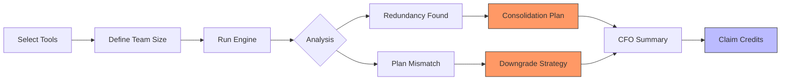

# Landing Page Copy and Messaging

This document defines the high-converting copy and visual communication strategy for the SpendScope landing page.

## Hero Section

### Headline
**Stop Overpaying for AI. Audit Your Stack in 30 Seconds.**

### Subheadline
Identify redundant subscriptions, unused seats, and expensive plan mismatches. Get a deterministic financial report and unlock discounted Credex credits.

### Main Call to Action
[ Run Free Audit ]

### Secondary Action
[ View Credit Inventory ]

---

## The Audit Flow

---

## Features and Value Propositions

### 1. Deterministic Accuracy
Unlike LLM-based calculators, our engine uses hard-coded pricing rules verified against official vendor documentation. We account for complex edge cases like the Claude Team 5-seat minimum and tiered GitHub Enterprise rates.

### 2. Zero-Access Auditing
We never ask for API keys or billing dashboard access. Our audit is performed based on your reported stack, ensuring 100% privacy and security for your financial data.

### 3. Immediate Remediation
We don't just find problems; we provide the solution. For qualified high-spend teams, we provide direct access to Credex's secondary market for AI credits, allowing you to secure your remaining stack at up to 30% off retail.

---

## Social Proof

**Verified Savings Results**

> "We saved $1,800/year for our 5-person engineering team by consolidating Cursor and Copilot licenses. The report was instant and precise."
> — **Technical Founder, Seed Stage AI Startup**

> "SpendScope caught a 'Ghost License' issue where we were paying for three seats we hadn't assigned yet on Claude Team. Incredible ROI for a free tool."
> — **VP Engineering, Series A SaaS**

---

## Frequently Asked Questions

### How precise is the savings estimate?
The estimate is based on current public pricing tiers updated weekly. While it doesn't account for specific enterprise negotiations you may have, it is 100% accurate for standard public pricing models across all major AI platforms.

### Why do I need to enter my email?
The core audit result is displayed instantly and anonymously. Email is only required if you wish to receive a persistent PDF report for your records or if you want to book a consultation to redeem discounted Credex credits.

### What tools do you currently support?
We support all primary developer AI platforms including Cursor, GitHub Copilot, ChatGPT (Plus/Team), Claude (Pro/Team), Gemini (Advanced), and Windsurf, along with API-level spend auditing for OpenAI and Anthropic.

### How does Credex offer discounted credits?
Credex acquires surplus AI credits from companies that have downsized or pivoted. We verify these credits and provide them to active developers at a significant discount, creating a efficient secondary market for compute.

### Is this tool free?
Yes. SpendScope is a free utility provided by Credex to help startup founders maintain capital efficiency. We believe that helping you save money on retail subscriptions makes it easier for you to scale your core AI infrastructure.

