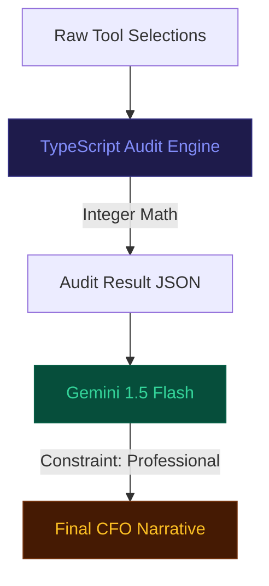

# Prompt Engineering & LLM Specifications

This document details the prompt architecture and orchestration used to generate professional financial narratives from raw audit data.

## Narrative Orchestration

SpendScope utilizes **Gemini 1.5 Flash** to transform deterministic JSON data into a cohesive audit summary.

### Summary Generation Protocol

| Objective | Logic | Implementation |
| :--- | :--- | :--- |
| **Integrity** | Deterministic Pre-processing | All math is computed in `auditEngine.ts` before reaching the LLM. |
| **Brevity** | Strict Word Ceiling | Capped at 80 words to maintain UI layout consistency. |
| **Persona** | Expert SaaS Analyst | Tone is clinical, objective, and devoid of marketing "fluff". |

---

## Technical Specifications

### System Architecture
The LLM is prompted via a `System Instruction` that defines its operational boundaries.

**System Role Definition:**
> "Act as a clinical SaaS CFO. Analyze audit JSON. Provide objective guidance. No introductory filler. No emojis. Output raw text only."

### User Prompt Construction

The following template is utilized in `src/app/api/summary/route.ts`:

```text
AUDIT_DATA:
- Current Monthly Spend: ${{totalSpend}}
- Potential Savings: ${{potentialSavings}}
- Engineering Team Size: {{teamSize}}
- Core Focus: {{primaryUseCase}}
- Logic Flags: {{recommendationsJSON}}

INSTRUCTION:
Synthesize a single-paragraph executive summary (75 words max). 
Focus on the direct relationship between the team size and the identified 
plan redundancies. If savings exceed $150, mention Credex bulk credit 
eligibility as the primary path for further optimization.
```

---

## Prompt Evaluation & Safety

| Constraint | Enforcement Method | Rationale |
| :--- | :--- | :--- |
| **Zero Hallucination** | Data Injection | LLM cannot generate new spending figures; it only reports values provided in the JSON. |
| **Design Stability** | Character Limit | Ensures the "Executive Summary" card does not cause layout shifts in the UI. |
| **Tone Control** | Negative Prompting | Explicitly forbids "Good job!" or "Great news!" to maintain auditor credibility. |

## AI Reliability Mermaid




