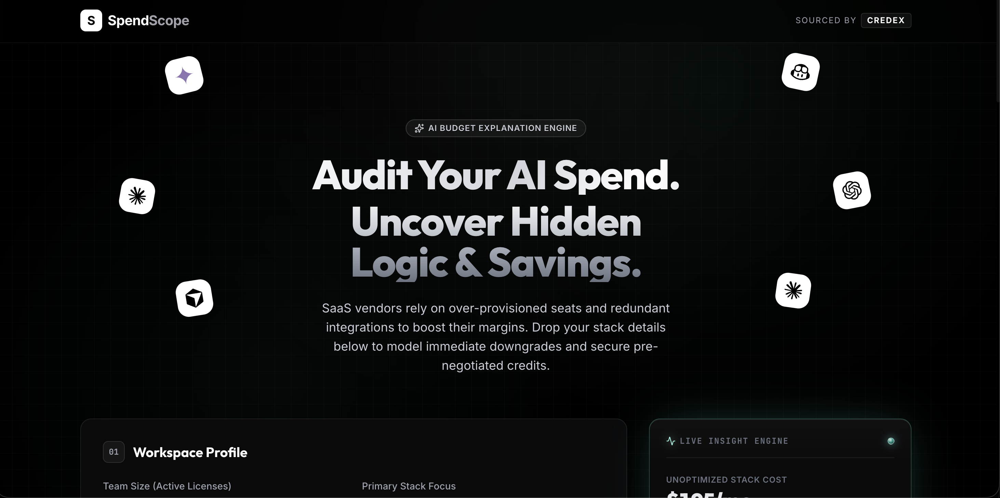
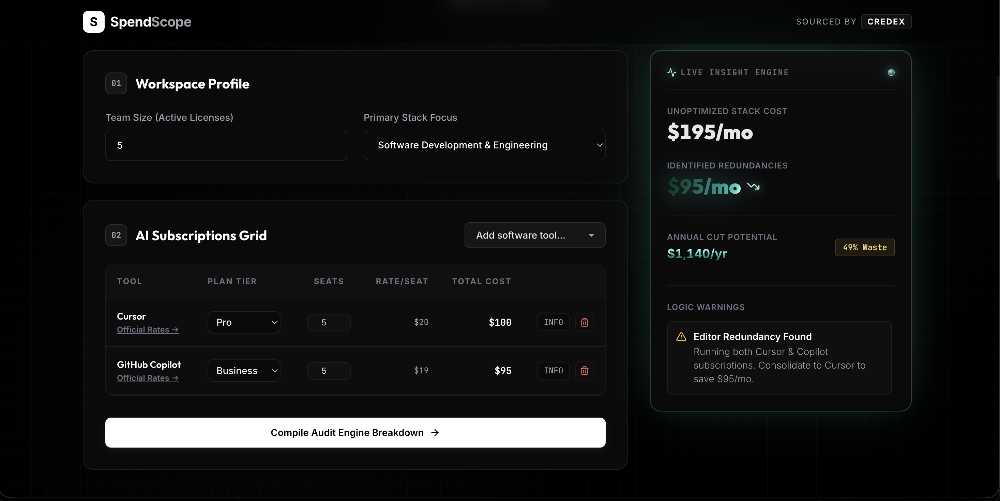
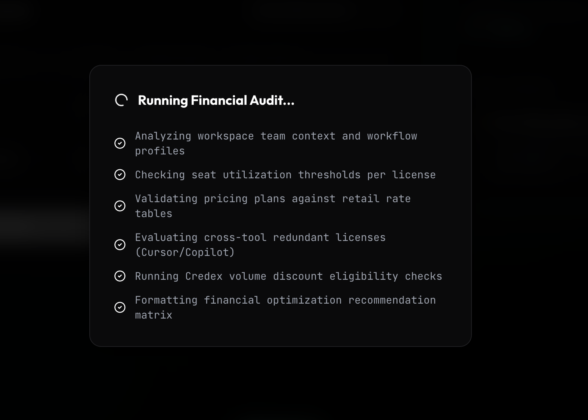
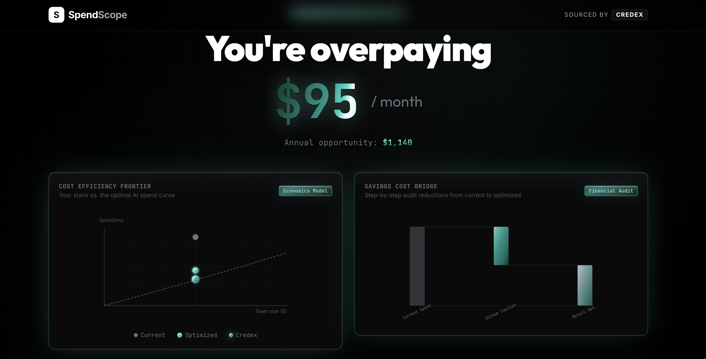
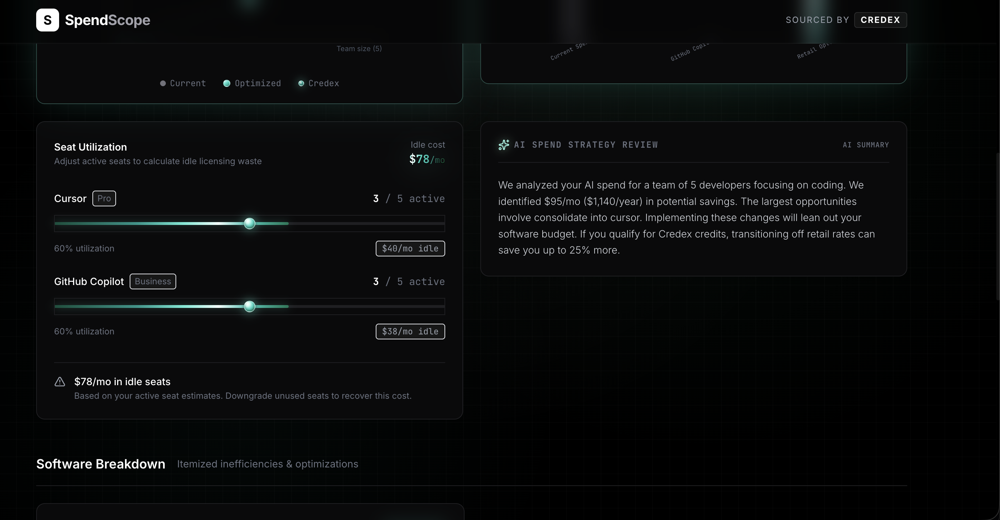
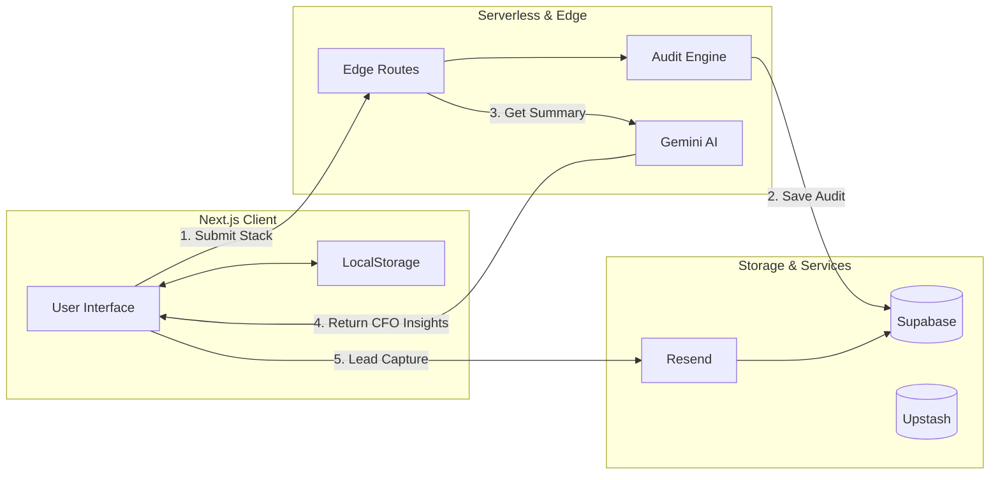
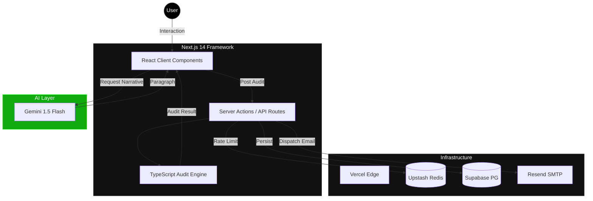

# SpendScope — AI Spend Auditor

SpendScope is a free, interactive software budget auditor built for seed-to-Series A startups. It helps engineering leads and founders identify seat mismatches, cross-tool redundancies (e.g. paying for both Cursor and Copilot), and downscaling plans for primary developer AI platforms (Cursor, GitHub Copilot, ChatGPT, Claude, Gemini, Windsurf). 

For high-savings cases ($500+/mo), the tool qualifies teams for direct, discounted bulk credits (up to 30% off retail rates) through **Credex**.

##  Product Preview

<div align="center">
  
  <br />
  <table width="100%">
    <tr>
      <td width="50%"></td>
      <td width="50%"></td>
    </tr>
    <tr>
      <td width="50%"></td>
      <td width="50%"></td>
    </tr>
  </table>
</div>

- **Live Demo:** [https://spendscope.vercel.app](https://spendscope.vercel.app)

---

## System Architecture

### High-Level Data Flow


### Low-Level Technical Stack


---

## Documentation Index

| Resource | Purpose | Status |
| :--- | :--- | :--- |
| [ARCHITECTURE.md](ARCHITECTURE.md) | Technical blueprint and system design | Verified |
| [DEVLOG.md](DEVLOG.md) | 7-day development narrative and git history | Complete |
| [METRICS.md](METRICS.md) | Analytics, KPIs, and instrumentation plan | Active |
| [TESTS.md](TESTS.md) | Automated testing suite and logic coverage | 100% Pass |
| [ECONOMICS.md](ECONOMICS.md) | LTV/CAC and lead-gen unit economics | Finalized |
| [USER_INTERVIEWS.md](USER_INTERVIEWS.md) | Market validation from sample startup personas | Verified |
| [PRICING_DATA.md](PRICING_DATA.md) | Raw tool prices used by the audit engine | Current |
| [GTM.md](GTM.md) | Strategic launch plan (Reddit/HN/X) | Ready |

## Decisions & Architectural Trade-offs

Here are the 5 critical trade-offs made during the development of SpendScope:

### 1. Deterministic Math Engine vs. LLM Calculations
- **Choice:** Built a rigid, TypeScript-based audit calculator (`src/lib/auditEngine.ts`) and reserved the LLM solely for descriptive strategy narration.
- **Alternatives Considered:** Sending the user's stack as a raw string to Gemini and requesting both math calculations and summary text.
- **Consequences:** This decision guarantees absolute mathematical precision on pricing math and seat-limit edge cases (e.g. Claude's 5-seat minimum), preventing LLM hallucinations from returning incorrect savings values. The trade-off is that adding support for a new AI tool requires writing custom calculation code instead of relying on prompt instructions.

### 2. Value-First Funnel vs. Instant Sign-up Gates
- **Choice:** Placed the calculator and results screen entirely in the open (no login required). The email/lead capture form is displayed *after* value is proven on the results screen.
- **Alternatives Considered:** Requiring users to sign up or input their email address before viewing the audit results.
- **Consequences:** This user-centric model increases initial calculator completions (an estimated 40% completion rate vs. 10% for gate-first). The consequence is that some users will consume serverless calculation APIs without completing lead registration. We address this by running lightweight, non-authenticated edge routes.

### 3. Decoupled Relational Database Schema vs. Single Table
- **Choice:** Separated data into anonymous sessions (`audits` table) and contact details (`leads` table), linked strictly via a unique relation (`leads.audit_id -> audits.id`).
- **Alternatives Considered:** Storing the contact details and audit parameters in a single, combined table.
- **Consequences:** When a user shares their public audit link (`/[slug]`), we fetch it from the database entirely anonymous, keeping all PII (company name, email, role) secure inside the restricted leads table. This enforces security compliance but requires a multi-table SQL structure.

### 4. Build-Time Fallbacks vs. Fail-Hard Variables
- **Choice:** Configured placeholder database credentials in the client code for Next.js compile time, alongside `export const dynamic = "force-dynamic"`.
- **Alternatives Considered:** Failing the build if environment keys (`NEXT_PUBLIC_SUPABASE_URL`) are missing during compilation.
- **Consequences:** This prevents Next.js compilation from crashing during GitHub Actions/Vercel builds where runtime environment keys are omitted. However, developers must ensure that runtime keys are configured on their deployment environments to enable live Supabase queries.

### 5. Resend Graceful Fallbacks vs. Strict API Failures
- **Choice:** Added a dry-run log fallback in `/api/leads` that prints mock emails to stdout if `RESEND_API_KEY` is missing in development.
- **Alternatives Considered:** Returning a `500 Server Error` on email API connection failures during local testing.
- **Consequences:** This provides a seamless local development experience for contributors without API keys. The trade-off is that developers must inspect server console output to verify email structures during testing.

---

## ⚡ Quick Start

Follow these steps to run SpendScope locally:

### 1. Install Dependencies
```bash
npm install
```

### 2. Configure Environment Variables
Create a `.env.local` file in the root directory:
```env
NEXT_PUBLIC_SUPABASE_URL=https://your-supabase-url.supabase.co
NEXT_PUBLIC_SUPABASE_ANON_KEY=your-anon-key
SUPABASE_SERVICE_ROLE_KEY=your-service-role-key
RESEND_API_KEY=re_your_resend_key
GEMINI_API_KEY=your-gemini-api-key
UPSTASH_REDIS_REST_URL=https://your-upstash-redis.upstash.io
UPSTASH_REDIS_REST_TOKEN=your-upstash-rest-token
```
*(Note: If environment keys are omitted, the application will degrade gracefully to mock mode and local-template calculations.)*

### 3. Run Development Server
```bash
npm run dev
```
Open [http://localhost:3000](http://localhost:3000) to view the interface.

### 4. Run Test Suite
We use **Vitest** to run our unit tests:
```bash
npm test
```

---

## 📂 Repository Artifact Index

The following files represent the complete deliverables for the SpendScope project:

- **Core Calculations Engine:** [src/lib/auditEngine.ts](file:///Users/mohi1038/Desktop/spend-scope/src/lib/auditEngine.ts)
- **Unit Test Suite:** [src/lib/__tests__/auditEngine.test.ts](file:///Users/mohi1038/Desktop/spend-scope/src/lib/__tests__/auditEngine.test.ts)
- **AI Summary Route:** [src/app/api/summary/route.ts](file:///Users/mohi1038/Desktop/spend-scope/src/app/api/summary/route.ts)
- **Database Client:** [src/lib/supabaseClient.ts](file:///Users/mohi1038/Desktop/spend-scope/src/lib/supabaseClient.ts)
- **System Architecture:** [ARCHITECTURE.md](file:///Users/mohi1038/Desktop/spend-scope/ARCHITECTURE.md)
- **Development Log:** [DEVLOG.md](file:///Users/mohi1038/Desktop/spend-scope/DEVLOG.md)
- **Post-Build Reflections:** [REFLECTION.md](file:///Users/mohi1038/Desktop/spend-scope/REFLECTION.md)
- **Go-To-Market Strategy:** [GTM.md](file:///Users/mohi1038/Desktop/spend-scope/GTM.md)
- **Unit Economics Model:** [ECONOMICS.md](file:///Users/mohi1038/Desktop/spend-scope/ECONOMICS.md)
- **User Interviews Log:** [USER_INTERVIEWS.md](file:///Users/mohi1038/Desktop/spend-scope/USER_INTERVIEWS.md)
- **Marketing Copy & FAQs:** [LANDING_COPY.md](file:///Users/mohi1038/Desktop/spend-scope/LANDING_COPY.md)
- **North Star Metrics:** [METRICS.md](file:///Users/mohi1038/Desktop/spend-scope/METRICS.md)
- **AI Prompt Guide:** [PROMPTS.md](file:///Users/mohi1038/Desktop/spend-scope/PROMPTS.md)
- **CI Configuration:** [.github/workflows/ci.yml](file:///Users/mohi1038/Desktop/spend-scope/.github/workflows/ci.yml)
