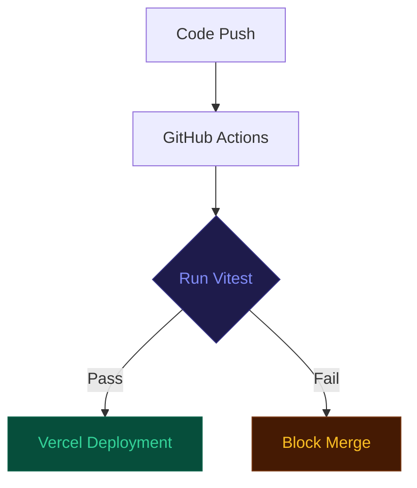

# Automated Test Specifications

This document details the automated testing suite for the SpendScope audit engine, ensuring mathematical precision and rule integrity.

## Test Infrastructure

| Component | Specification |
| :--- | :--- |
| Framework | Vitest 1.x |
| Language | TypeScript |
| Environment | Node.js (Server-side logic testing) |
| Coverage Target | 100% Core Calculation Logic |

## Execution Protocol

To execute the test suite, run the following commands in the project root:

```bash
# Production test run
npm run test

# Development watch mode
npx vitest
```

## Core Test Matrix

All logic verification is centralized in `src/lib/__tests__/auditEngine.test.ts`.

| ID | Test Scenario | Logic Verified | Validation Criteria |
| :-- | :--- | :--- | :--- |
| T01 | Redundant Editor Conflict | Cursor + GitHub Copilot overlap | Flag Copilot as redundant; suggest consolidation |
| T02 | Plan Floor Minimums | Claude Team (< 5 seats) | Flag empty seat overhead; suggest Pro downgrade |
| T03 | Tier Mismatch | Single-user Business plans | Flag Business features as unnecessary; suggest Pro |
| T04 | API Optimization | High-volume API spend (> $100) | Recommend prompt caching implementation |
| T05 | Optimal Configuration | Validated efficient stack | Return zero recommendations; set `isOptimal: true` |
| T06 | B2B Conversion Trigger | High-spend qualification (> $500) | Inject discounted Credex credit recommendation |

## Automation & Integrity



## Test Run Output (Local Execution)

```bash
> spend-scope@0.1.0 test
> vitest run

 RUN  v4.1.7 /Users/mohi1038/Desktop/spend-scope

 ✓ src/lib/__tests__/auditEngine.test.ts (6 tests) 2ms
   ✓ Spend Audit Engine Core Calculations (6)
     ✓ Test Case 1: Redundant Editor Subscriptions (Cursor + Copilot) 1ms
     ✓ Test Case 2: Claude Team Seat Minimum Overpay 0ms
     ✓ Test Case 3: Single Seat Plan Overkill (Cursor Business -> Pro) 0ms
     ✓ Test Case 4: API Direct Prompt Caching Savings 0ms
     ✓ Test Case 5: Already Optimal Stack (Honest spent-well message) 0ms
     ✓ Test Case 6: Credex Infrastructure Credits Qualification 0ms

 Test Files  1 passed (1)
      Tests  6 passed (6)
   Start at  20:10:14
   Duration  155ms (transform 23ms, setup 0ms, import 30ms, tests 2ms, environment 0ms)
```
